# Exemplos / Examples

## 🇵🇹 Português

Ficheiros de demonstração para experimentar a MESADELUX sem começar do zero.

### Conteúdo

- `exempl2.ldsk` — ficheiro de show de demonstração (150 canais).

Para abrir: **Ficheiro → Abrir** e escolher o `.ldsk`.

### O que o exemplo traz

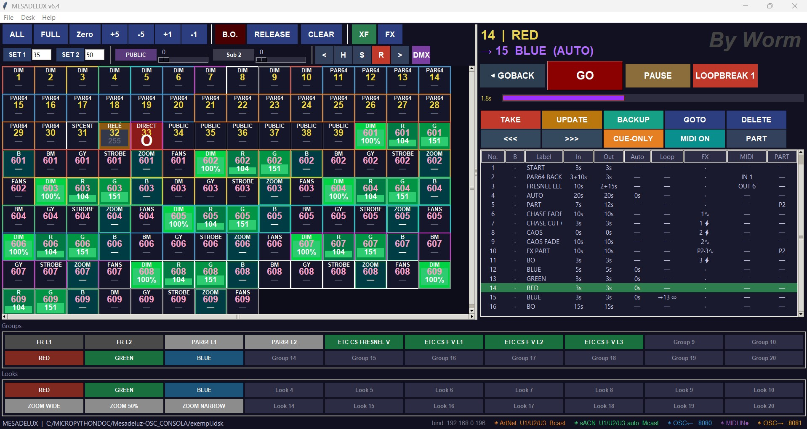

- **Patch de exemplo**: dimmers (DIM), PAR64, circuitos de público (PUBLIC),
  um relé e um directo, e aparelhos LED multi-parâmetro (601–609) com
  atributos R/G/B, mistura (BM), cinzento (GY), STROBE, ZOOM e FANS —
  agrupados por alcunha (o mesmo aparelho partilha o número).
- **21 memórias (cues)** que demonstram as funcionalidades: tempos de
  entrada/saída com atrasos (`3+10s`), AUTO-follow, LOOP (`→13 ∞`),
  PARTES (coluna PART), CAOS em fade e em corte, FX ligados às
  memórias (⚡ imediato / ∿ acompanha o fade) e MIDI IN/OUT por cue.
- **Grupos e Looks** pré-gravados (RED/GREEN/BLUE, ZOOM WIDE/50%/NARROW…).

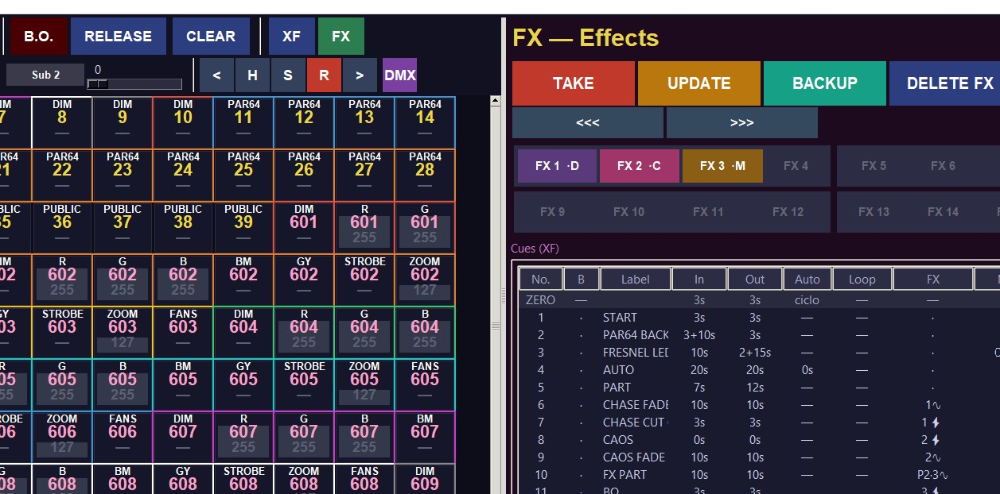

- **3 efeitos (FX)** gravados — dinâmico, Caos e manual — para ligar e
  desligar na página FX ou a partir das memórias.

### Quick Start — primeiros passos

#### 1. Fazer o patch

Selecciona um canal na grelha e prime a tecla **R** (na barra `< H S R >`)
para abrir o patch desse canal: alcunha, nome, universo, endereços DMX de
8 bit (vários somam-se: `3 + 9 + 11`), canal fino de 16 bit, valor por
defeito, halo (cor da moldura), display (0–100 % ou 0–255) e curva.

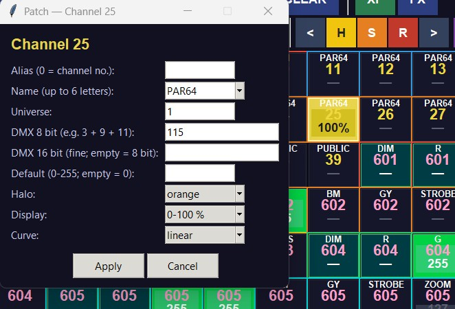

Com o **R** armado, clicar numa célula do monitor **DMX** faz o caminho
inverso: dizes que canal da mesa controla aquele endereço.

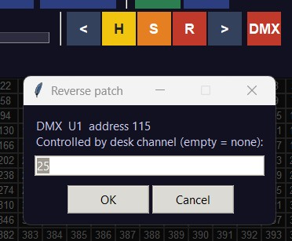

Para aparelhos multi-parâmetro usa o **Repetir Aparelho** no renumerador:
escreves a pegada (footprint) uma vez — p.ex.
`DIM R G B BM GY STROBE ZOOM FANS@255` — e carimbas N cópias a partir de
um canal e endereço iniciais, com alcunha incremental (601, 602, …: todos
os parâmetros do mesmo aparelho partilham o número).

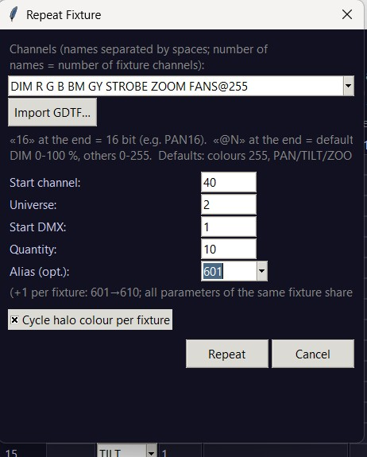

O botão **Import GDTF…** lê um ficheiro `.gdtf` do fabricante, mostra os
modos DMX e gera a pegada automaticamente.

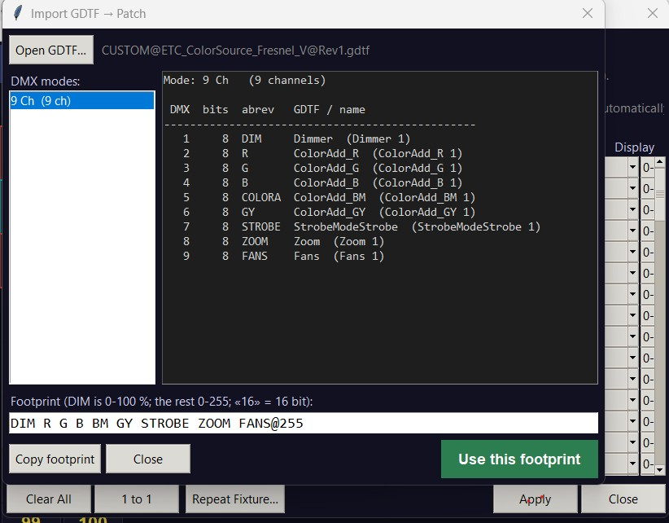

#### 2. Ver o que se está a fazer: Highlight e Solo

**H** (Highlight) acende o canal seleccionado ao nível de teste, sem mexer
no resto — óptimo para identificar projectores um a um.

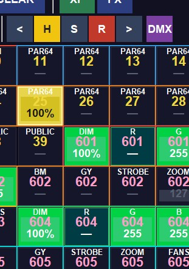

**S** (Solo) apaga na saída tudo o que não está seleccionado.

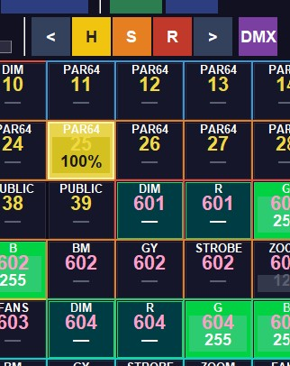

#### 3. A tecla TAKE (comprar) — sempre em dois toques

Regra geral da mesa: a tecla **TAKE** funciona sempre em **dois toques** —
o primeiro arma, o segundo grava. É assim para tudo: memórias, grupos,
looks, FX e submasters.

Para gravar uma memória (cue): põe os níveis (clica e arrasta na grelha,
ou usa os pré-valores 0%/25%/50%/75%/100% e +5/−5) e prime **TAKE duas
vezes**: aparece o diálogo da memória — número, etiqueta, fade in/out,
atrasos e AUTO (vazio = sem auto-follow; 0 = segue logo a seguir à
transição). **SAVE** grava.

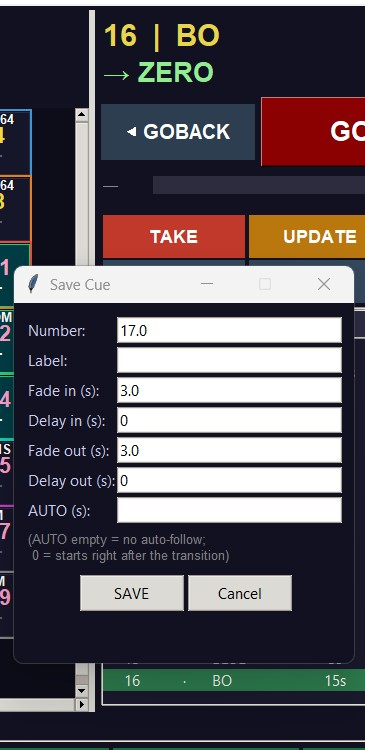

**UPDATE** actualiza a memória onde estás; **GOBACK / GO / PAUSE** tocam a
lista.

#### 4. Grupos e Looks (retratos)

- Um **Grupo** guarda uma selecção de canais; um **Look** guarda níveis.
- Selecciona os canais (ou monta o estado que queres), prime **TAKE** e
  depois a tecla de Grupo ou de Look onde queres gravar (o segundo toque
  grava lá).

#### 5. Efeitos (FX)

Criar um FX: prime **TAKE** e depois a tecla FX que queres usar — abre um
menu para escolher o **tipo** (dinâmico, Caos ou manual) e o editor abre
automaticamente.

- **Dinâmico e Caos**: com o editor aberto, selecciona na grelha os canais
  que o efeito vai usar e prime **TAKE duas vezes** — os canais ficam
  tomados pelo FX. Depois afina os parâmetros no editor.
- **Manual**: igual, mas passo a passo — selecciona os canais, dá-lhes um
  valor e prime **TAKE duas vezes** para gravar o passo; podes escolher o
  fade e o tempo de avanço automático, que se repetem nos passos
  seguintes.

Com a tecla FX:

- **Botão esquerdo** — arranca/pára o FX (toggle) — funciona mesmo com o
  editor aberto.
- **Botão direito** — abre o editor; outro botão direito fecha-o.

Os três tipos:

**Dinâmico (·D)** — paramétrico: curva (sino…), direcção, BPM,
attack/decay, largura, blocos/grupos e cruzamento entre vizinhos.

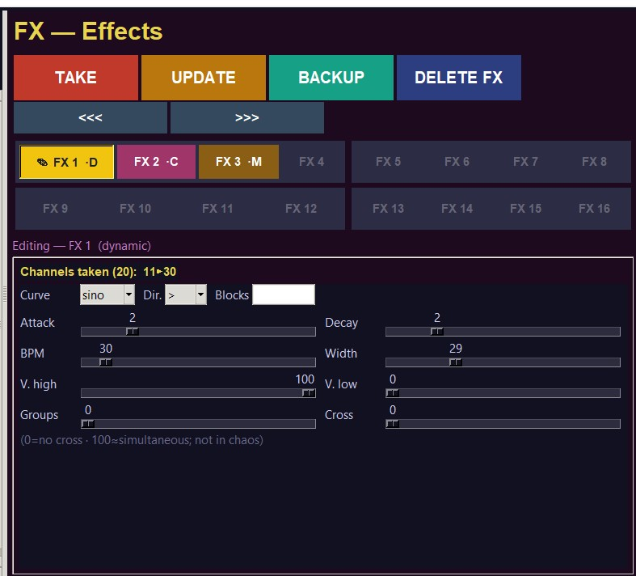

**Caos (·C)** — sorteia que canais acendem e quando: BPM, grau de caos,
quantidade mínima/máxima de canais (0/0 = cintilação).

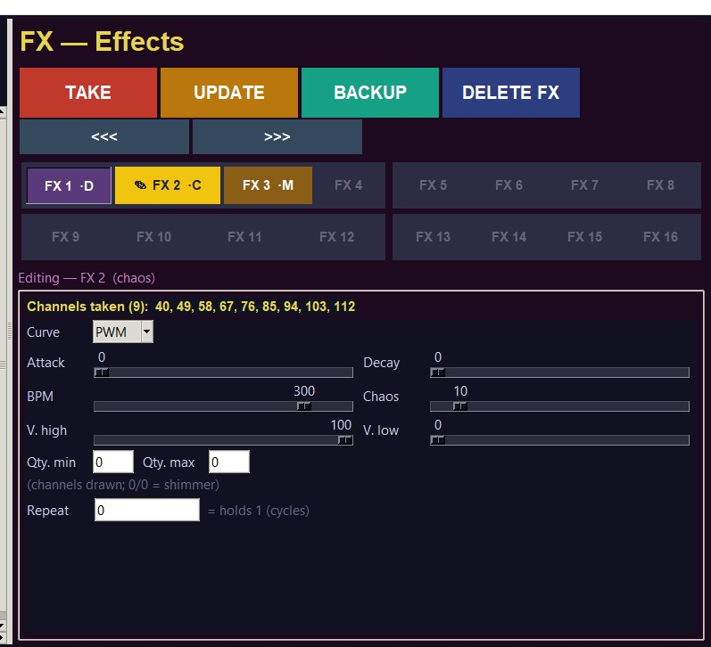

**Manual (·M)** — passos em cadeia: cada passo tem os seus canais, fade e
tempo de avanço automático.

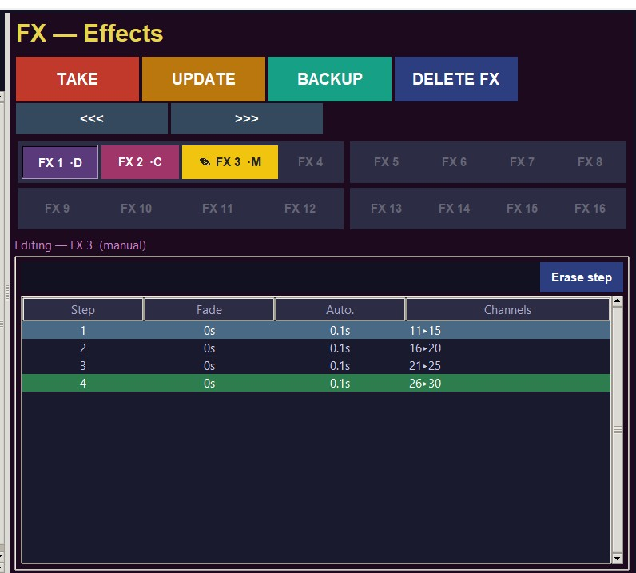

Os FX também se ligam às memórias (coluna FX da cuelist: ⚡ dispara
imediato, ∿ acompanha o fade da memória).

TODO: instruções adicionais ditadas pelo autor.

---

## 🇬🇧 English

Demo files to try MESADELUX without starting from scratch.

### Contents

- `exempl2.ldsk` — demo show file (150 channels).

To open it: **File → Open** and pick the `.ldsk`.

### What the example includes

- **Sample patch**: dimmers (DIM), PAR64s, house-light circuits (PUBLIC),
  a relay and a direct, plus multi-parameter LED fixtures (601–609) with
  R/G/B, mix (BM), grey (GY), STROBE, ZOOM and FANS attributes — grouped
  by nickname (the same fixture shares the number).
- **21 cues** demonstrating the features: in/out times with delays
  (`3+10s`), AUTO-follow, LOOP (`→13 ∞`), PARTS (PART column), CHAOS in
  fade and in cut, FX linked to cues (⚡ immediate / ∿ follows the fade)
  and per-cue MIDI IN/OUT.
- **Pre-recorded Groups and Looks** (RED/GREEN/BLUE, ZOOM WIDE/50%/NARROW…).

- **3 recorded effects (FX)** — dynamic, Chaos and manual — to toggle from
  the FX page or from the cues.

### Quick Start — first steps

#### 1. Patching

Select a channel in the grid and press the **R** key (on the `< H S R >`
bar) to open that channel's patch: alias, name, universe, 8-bit DMX
addresses (several add up: `3 + 9 + 11`), 16-bit fine channel, default
value, halo (frame colour), display (0–100 % or 0–255) and curve.

With **R** armed, clicking a cell in the **DMX** monitor goes the other
way round: you say which desk channel drives that address.

For multi-parameter fixtures use **Repeat Fixture** in the patch window:
you write the footprint once — e.g.
`DIM R G B BM GY STROBE ZOOM FANS@255` — and stamp N copies starting at a
given channel and address, with an incrementing alias (601, 602, …: all
parameters of the same fixture share the number).

The **Import GDTF…** button reads a manufacturer's `.gdtf` file, lists the
DMX modes and builds the footprint automatically.

#### 2. Seeing what you're doing: Highlight and Solo

**H** (Highlight) brings the selected channel to the test level without
touching anything else — great for identifying fixtures one by one.

**S** (Solo) blacks out everything that is not selected.

#### 3. The TAKE key — always two presses

General rule of the desk: the **TAKE** key always works in **two
presses** — the first arms, the second records. That applies to
everything: cues, groups, looks, FX and submasters.

To record a cue: set your levels (click and drag on the grid, or use the
presets 0%/25%/50%/75%/100% and +5/−5) and press **TAKE twice**: the cue
dialog opens — number, label, fade in/out, delays and AUTO (empty = no
auto-follow; 0 = starts right after the transition). **SAVE** records it.

**UPDATE** updates the current cue; **GOBACK / GO / PAUSE** play the list.

#### 4. Groups and Looks

- A **Group** stores a channel selection; a **Look** stores levels.
- Select the channels (or build the state you want), press **TAKE** and
  then the Group or Look key where you want to record it (the second
  press records there).

#### 5. Effects (FX)

To create an FX: press **TAKE** and then the FX key you want to use — a
menu opens to choose the **type** (dynamic, Chaos or manual) and the
editor opens automatically.

- **Dynamic and Chaos**: with the editor open, select on the grid the
  channels the effect will use and press **TAKE twice** — the channels
  are taken by the FX. Then tune the parameters in the editor.
- **Manual**: same idea, but step by step — select the channels, give
  them a value and press **TAKE twice** to record the step; you can set
  the fade and the auto-advance time, which repeat on the following
  steps.

On the FX key:

- **Left click** — starts/stops the FX (toggle) — works even with the
  editor open.
- **Right click** — opens the editor; another right click closes it.

The three types:

**Dynamic (·D)** — parametric: curve (sine…), direction, BPM,
attack/decay, width, blocks/groups and crossing between neighbours.

**Chaos (·C)** — draws which channels light up and when: BPM, chaos
amount, minimum/maximum channel count (0/0 = shimmer).

**Manual (·M)** — chained steps: each step has its own channels, fade and
auto-advance time.

FX can also be linked to cues (FX column of the cue list: ⚡ fires
immediately, ∿ follows the cue's fade).

TODO: additional instructions dictated by the author.

By Worm
