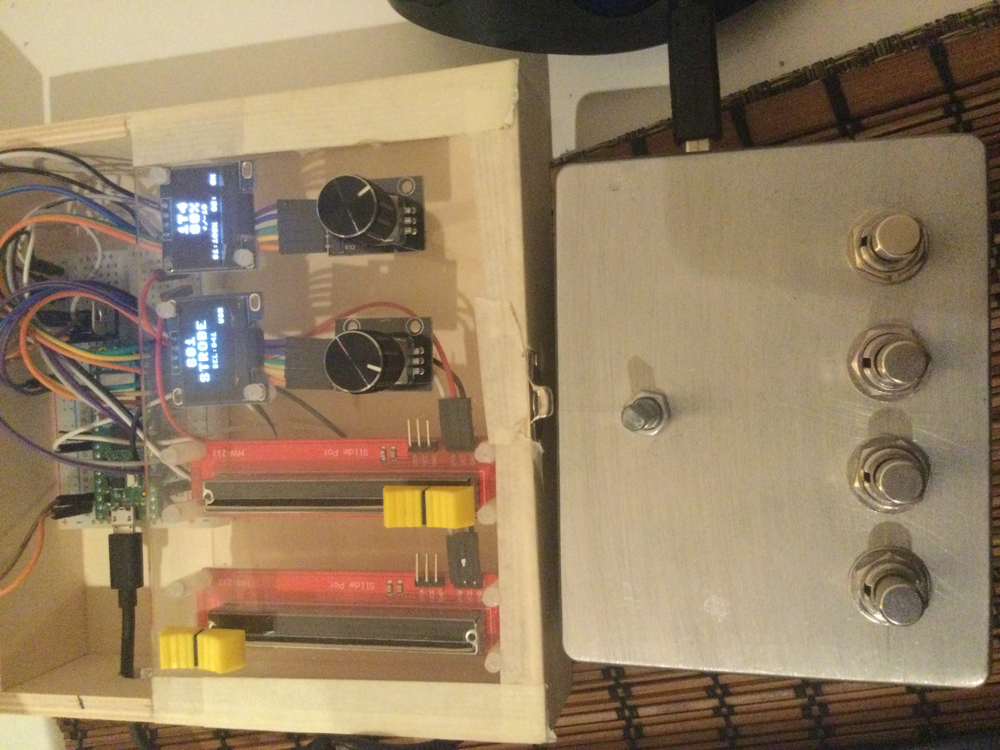

# Firmware das consolas físicas / Physical console firmware (Raspberry Pi Pico W)

## 🇵🇹 Português

Firmware MicroPython das duas consolas físicas da MESADELUX. Cada consola
liga-se à app por WiFi (OSC/UDP) ou por USB através do bridge (ver a pasta
[`bridge/`](../bridge)).

*Consola 1 (em cima, caixa aberta) e Consola 2 (em baixo).*

### As duas consolas

- **`pico_consola1_v6/`** — consola principal: encoders, display OLED
  (SSD1306), teclas de memórias e GO.
  - `main.py` — programa principal
  - `rotary.py`, `rotary_irq_rp2.py` — leitura dos encoders
  - `ssd1306.py`, `writer.py` — display OLED
- **`pico_consola2_v5/`** — consola auxiliar (submasters/execução).
  - `main.py` — programa principal
  - `rotary.py`, `rotary_irq_rp2.py` — leitura dos encoders

### Instalação (resumo)

1. Instalar o MicroPython no Pico W (ficheiro `.uf2` de
   <https://micropython.org/download/RPI_PICO_W/>): ligar o Pico ao PC com
   o botão BOOTSEL carregado e copiar o `.uf2` para a drive que aparece.
2. Copiar **todos os ficheiros `.py`** da pasta da consola para a flash do
   Pico (com o Thonny, por exemplo: Ver → Ficheiros).
3. Copiar `secrets.example.py` para `secrets.py` **no Pico** e preencher o
   SSID e a password da rede WiFi.
   - Em alternativa: criar um ficheiro `wifi.txt` na flash do Pico com duas
     linhas (linha 1 = SSID, linha 2 = password).
4. Reiniciar o Pico — o `main.py` arranca sozinho.

> **Nunca** publiques o teu `secrets.py` nem o `wifi.txt`: contêm a password
> da tua rede. Só o `secrets.example.py` (sem dados reais) é versionado.

### Iniciação à programação

TODO: instruções de iniciação ditadas pelo autor (como abrir o código no
Thonny, como experimentar alterações simples, por onde começar a ler o
`main.py`, etc.)

### Ligações de hardware

Ver [`hardware/ligacoes.md`](../hardware/ligacoes.md).

---

## 🇬🇧 English

MicroPython firmware for the two MESADELUX physical consoles. Each console
connects to the app over WiFi (OSC/UDP) or over USB through the bridge
(see the [`bridge/`](../bridge) folder).

*Console 1 (top, box open) and Console 2 (bottom).*

### The two consoles

- **`pico_consola1_v6/`** — main console: encoders, OLED display (SSD1306),
  cue keys and GO.
  - `main.py` — main program
  - `rotary.py`, `rotary_irq_rp2.py` — encoder reading
  - `ssd1306.py`, `writer.py` — OLED display
- **`pico_consola2_v5/`** — auxiliary console (submasters/playback).
  - `main.py` — main program
  - `rotary.py`, `rotary_irq_rp2.py` — encoder reading

### Installation (summary)

1. Install MicroPython on the Pico W (`.uf2` file from
   <https://micropython.org/download/RPI_PICO_W/>): plug the Pico into the
   PC while holding the BOOTSEL button and copy the `.uf2` to the drive
   that appears.
2. Copy **all the `.py` files** from the console's folder to the Pico's
   flash (with Thonny, for example: View → Files).
3. Copy `secrets.example.py` to `secrets.py` **on the Pico** and fill in
   your WiFi network's SSID and password.
   - Alternatively: create a `wifi.txt` file on the Pico's flash with two
     lines (line 1 = SSID, line 2 = password).
4. Restart the Pico — `main.py` starts on its own.

> **Never** publish your `secrets.py` or `wifi.txt`: they contain your
> network's password. Only `secrets.example.py` (with no real data) is
> versioned.

### Getting started with the code

TODO: getting-started instructions dictated by the author (how to open the
code in Thonny, how to try simple changes, where to start reading
`main.py`, etc.)

### Hardware wiring

See [`hardware/ligacoes.md`](../hardware/ligacoes.md).

By Worm
