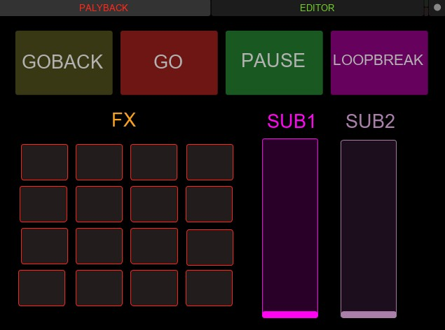
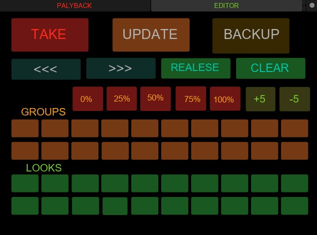

# Layout TouchOSC

Layout de exemplo para controlar a MESADELUX a partir de um telemóvel ou
tablet com a app [TouchOSC](https://hexler.net/touchosc) (versão Mk1).

## Ficheiro

- `tchmesadelux_osc2.touchosc` — o layout, com **duas páginas** (separadores
  no topo): PLAYBACK e EDITOR.

### Página 1 — PLAYBACK (apoio à reprodução do espectáculo)

- Botões de transporte: **GOBACK / GO / PAUSE / LOOPBREAK**
  (`/back`, `/go`, `/pause`, `/soltar`)
- Grelha **FX** — 16 toggles para ligar/desligar os 16 efeitos
  (`/fx/1/toggle` … `/fx/16/toggle`)
- Faders **SUB1** e **SUB2** — submasters (`/submaster/1`, `/submaster/2`)

### Página 2 — EDITOR (gravação e edição de memórias)

- **TAKE / UPDATE / BACKUP** — comprar (gravar memória nova), actualizar a
  memória actual e cópia de segurança do show
- **<<< / >>>** — navegar na lista de memórias
- **RELEASE / CLEAR** — libertar a saída / limpar o programador
- Pré-valores **0% / 25% / 50% / 75% / 100%** e ajuste fino **+5 / −5**
  para os canais seleccionados
- **GROUPS** — 16 teclas de grupos de canais
- **LOOKS** — 16 teclas de looks (retratos)

## Como usar

1. Instalar a app TouchOSC (Mk1) no telemóvel/tablet.
2. Transferir o layout para a app (pelo TouchOSC Editor ou pela função de
   sincronização da app).
3. Nas definições de ligação do TouchOSC, apontar para o **IP do computador
   onde corre a MESADELUX**, porta OSC da app.
4. O telemóvel e o computador têm de estar na **mesma rede WiFi**.

TODO: instruções detalhadas ditadas pelo autor (portas exactas, protocolo
OSC completo — ver também o menu Ajuda → Ajuda OSC na app).

By Worm
